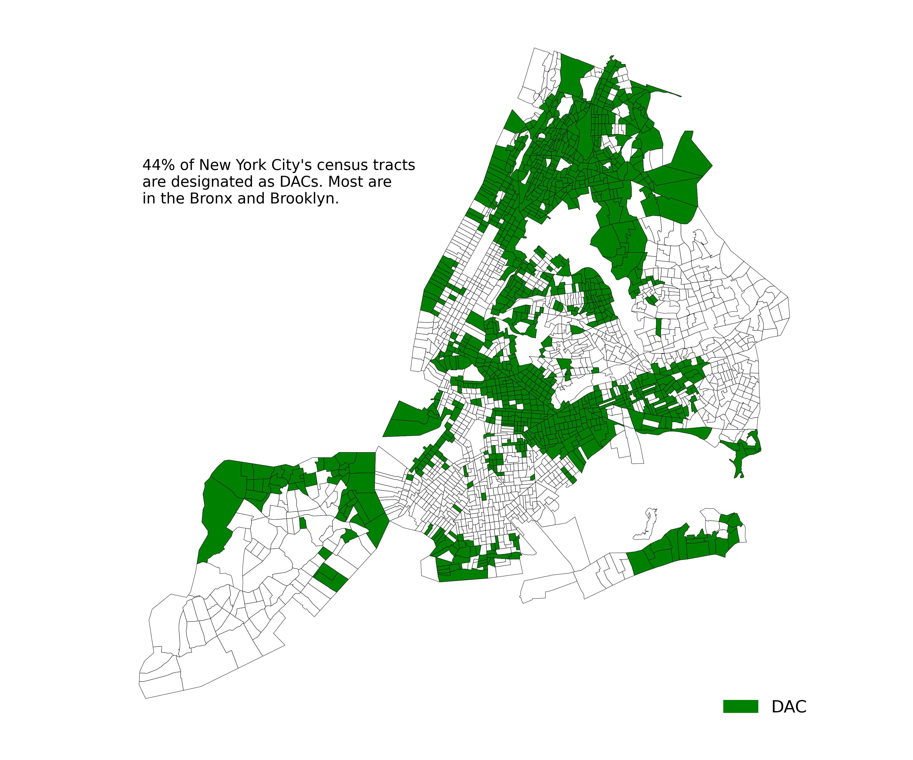
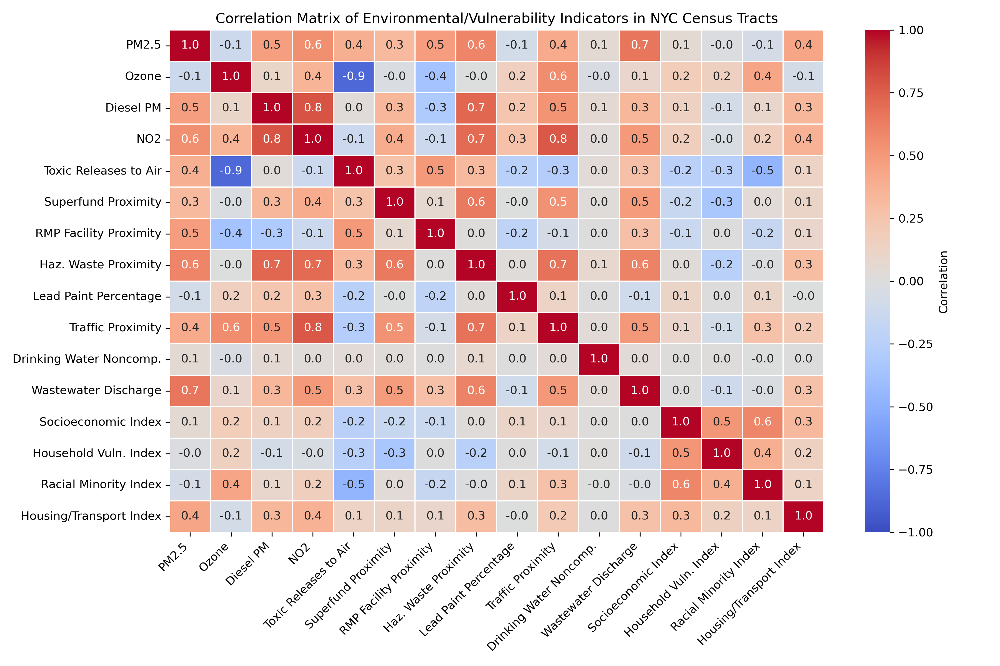
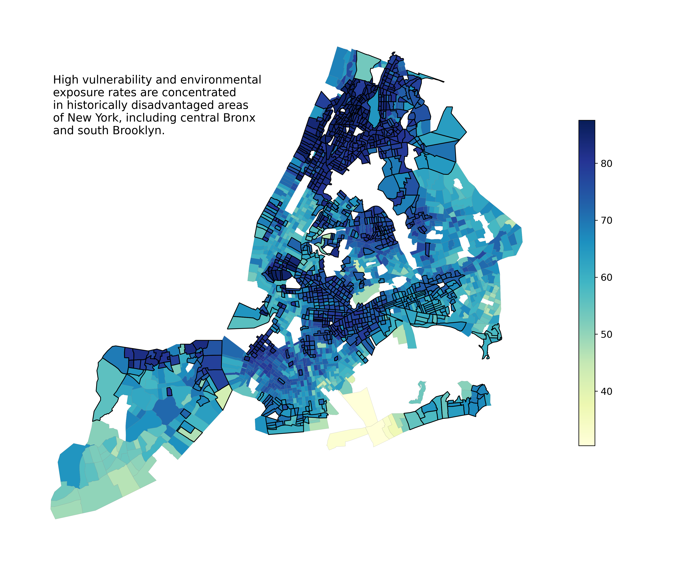
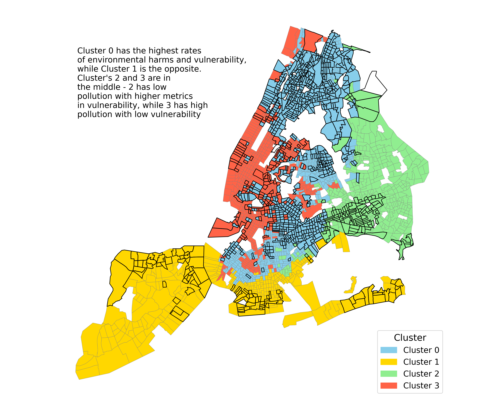

# Analyzing New York State's Environmental Justice Area Designations (DACs) in New York City

## Summary

This file recontextualizes the Disadvantaged Communities (DAC) Criteria approved by the New York State Climate Justice Working Group with data from the EPA's 2024 EJScreen and the CDC's 2022 SVI. By using the "best of the best" indicators for environmental harms and social vulnerability, a robust framework is established to identify the DAC communities in New York City (NYC) that are most at risk to anthropogenic and natural climatic events.

## Objectives

### 1. Create an accessible, widely applicable dataframe for use in analysis of NYC DAC characteristics

### 2. Provide insight into the most vulnerable DAC census tracts in NYC using high quality U.S.-level percentile indicators

### 3. Visualize indicators and their spatial distribution across NYC and among DACs

## Background
In 2023, New York's Climate Justice Working Group finalized the state's criteria for defining "disadvantaged communities" or environmental justice areas that are most vulnerable to the impacts of environmental harms and climate change. A wide variety of variables are used to create this criteria, but designations were developed using now retired census tracts (2010) with data from 2019. Through the incorporation of EJScreen and SVI data, these designations can be transitioned to 2020 tracts and analyzed with high quality indicators.  

Several assumptions are made in the analysis:
* A weight is not used in the conversion of DAC designations from 2010 to 2020 census tracts as the designation holds for tracts that were splintered into several in 2020. Understanding the suitability of the merge should be revisited in later analysis.

* SVI is preferred as a means of measuring social vulnerability compared to indices in EJScreen as it is more comprehensive. EJScreen does however have the majority of variables used in the SVI from similar sources, meaning the SVI could be avoided if only using EJScreen is preferred.

* Environmental indicators are treated with equal weight despite not being equally impactful in reality (e.g., exposure to PM2.5 likely has more of an impact on health outcomes than distance to RMP facilities or Drinking Water Compliance as it is included in the dataset). Further analysis should find or attempt to develop a framework for weighing each indicator's impact.

## Input Data

### 1. U.S. Environmental Protection Agency's EJScreen Data by Census Tract in 2024 (csv)
Retrieved from the Harvard Dataverse, the mapping tool hosted by the EPA is currently offline as of May 2025 but a cloned version is being hosted by the Public Environmental Data Partners (PEDP). Population and household measures along with percentile data for air pollution, water pollution, and proximity to environmental hazards (Super Fund sites, RMP facilities) at annual averages is subset. This dataset also includes individual EJ indices that combine EJScreen demographic characteristics with environmental indicators that were not used in this analysis. **While other input files are available on this Github page in 'input_data', this must be downloaded from the link due to file size restrictions.**

**Link:** https://dataverse.harvard.edu/file.xhtml?fileId=10775979&version=4.0

**Data Description:** https://www.epa.gov/system/files/documents/2024-07/ejscreen-tech-doc-version-2-3.pdf

**Variable Dicionary:** https://climateprogramportal.org/wp-content/uploads/2025/02/EJScreen_2024_BG_Percentiles_Columns.xlsx

### 2. U.S. Center for Disease Control Social Vulnerability Index (SVI) in 2022 (csv)
Retrieved from ATSDR's site, indices for socioeconomic status, household characteristics, racial and ethnic minority status, and housing type and transportation were subset. The overall SVI score was also included for use in the ejanalysis.py script.

**Link:** https://www.atsdr.cdc.gov/place-health/php/svi/svi-data-documentation-download.html

Path: 2022 > United States > Census Tracts > CSV File (table data)

**Data Description and Variable Dictionary:** https://svi.cdc.gov/map25/data/docs/SVI2022Documentation_ZCTA.pdf

### 3. New York State Disadvantaged Community Classifications in 2023 (csv)
Retrieved from the New York State Open Data portal, this dataset identifies areas that meet qualifying indicators to be listed as disadvantaged communities using data from 2019. 

**Link:** https://data.ny.gov/Energy-Environment/Final-Disadvantaged-Communities-DAC-2023/2e6c-s6fp/about_data

**Data Description:** https://data.ny.gov/api/views/2e6c-s6fp/files/01bcca7e-63a4-440f-8d41-839a7da69785?download=true&filename=NYSERDA_FINALDisadvantagedCommuniesDAC_DataDictionary.pdf

### 4. NHGIS Census Tract 2010 to 2020 Crosswalk (csv)
Retrieved from the National Historical Geographic Information System (NHGIS) site hosted by IPUMS, this file is used to convert DAC designated tracts from 2010 Census tract designations to 2020 tracts for merging with the EJScreen and SVI data.

**Link:** https://www.nhgis.org/geographic-crosswalks#download-2010-2020

### 5. 2024 Census Tract Shapefile for New York (zip)
Retrieved from the TIGER data download directory, this file is joined with indicators in the third script for visualization. 

**Link:** https://www.census.gov/cgi-bin/geo/shapefiles/index.php?year=2024&layergroup=Census+Tracts

## Description of Scripts
The scripts described below should be ran in the same order they are introduced (combine_ejindicators.py --> ejanalyze.py --> ejvisualize.py):

### 1. combine_ejindicators.py
This script reads in the csv files for EJScreen, SVI, and DAC classifications, subsets for relevant columns, and merges them using the NHGIS cross walk for DACs to create a data frame used in later analyses.

### 2. ejanalyze.py
This script uses combined burden scoring and K-means algorithmic cluster analysis to understand which DAC designated tracts are most vulnerable to different indicators. A heat map is also created to show how different indicators correlate.

Additional information on K-means based clustering: https://scikit-learn.org/stable/modules/clustering.html#k-means

### 3. ejvisualize.py
This script incorporates the tract shapefile to conduct geographic analysis using results from the analysis conducted in the previous script. Three maps are created - the first shows a simple distribution of DAC designations, the second shows the most vulnerable and environmentally exposed tracts with DAC boundaries, and the third shows the results of the cluster analysis with DAC boundaries.  

## Output Data

### 1. dacejssvi.csv
This csv incorporates data from all sources in a clean and reusable format for use in ejanalze.py. The goal for this file is to be universally functional for further analyses using DAC designations.

### 2. cumburdej.csv
This csv subsets some columns from dacejssvi.csv and incorporates the results of the cumulative burden scoring analysis, in addition to columns weighting population that were not used in visualizations.

### 3. clusteredej.csv
This csv subsets some columns from dacejssvi.csv and incorporates the cluster placements from the K-means analysis.

### 4. clustersumm.csv
This csv shows the results of the cluster analysis by cluster, in addition to showing how DAC designations are apportioned among clusters.

### 5. mapej.csv
This csv provides a simplified dataframe for use in ejvisualize.py with the results from the cumburdej.csv and clusteredej.csv. 

## Figures and Results

### Figure 1. A Map of NYC DAC Tracts

This map shows how DAC tracts are distributed in New York City.

### Figure 2. Correlation Heat Map for Included Indicators

This heat map shows how indicators used in this analysis are correlated. Most show no correlation, but there is a notable association among traffic related environmental indicators (Ozone, Diesel Particulate Matter (PM), NO2) and hazard proximity (Super Fund proximity, Hazardous Waste Facilities proximity, Wastewater Discharge).

### Figure 3. Burden Map

This map shows a gradient of the tracts that are most vulnerable (high percentile in SVI indices) and most exposed to various environmental hazards (high percentile in EJScreen indices). DAC designation mostly correlates with the highest scoring tracts, but there is some inconsistencies.

### Figure 4. Cluster Map

This map shows how the resulting clusters of the K-means analysis are distributed throughout the city. There is a clear geographic unity among most clusters (Cluster 1 is entirely in Staten Island and the coast of Brooklyn, Cluster 2 is in the least dense areas of Queens and Brooklyn). Both 1 and 2 had less extreme rates of pollution and vulnerability. Cluster 0 consists of the aras with the highest percentiles in both pollution and vulnerability, while Cluser 3 consists of areas with high percentile rates in pollution but low rates of vulnerability. Areas with historic rates of impoverishment are covered well by Cluster 0 while the wealthier parts of the city in very densely populated areas (e.g., southern Manhattan) are covered by cluster 3.

## Conclusions and Next Steps
Further analysis should be done with data on policy interventions and environmental justice specific programs as made available. Analysis could be improved with adequate weighting incorporated for different indicators (e.g., providing greater weight to particulate matter 2.5 exposure compared to hazardous waste site proximity) and further investigation into the quality of DAC designation distribution among highly vulnerable areas according to EJScreen and SVI indicators. 
